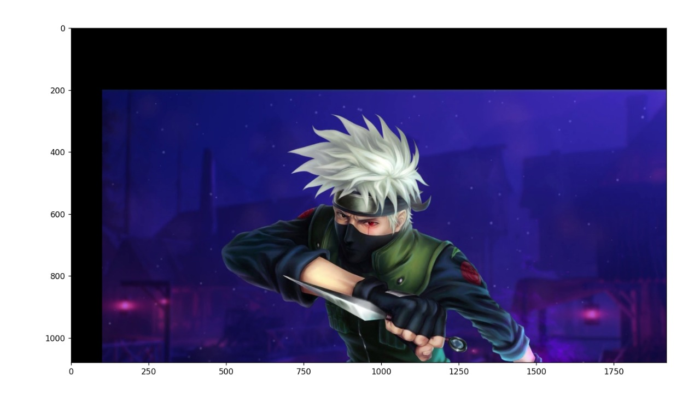

# Image-Transformation
## Aim
To perform image transformation such as Translation, Scaling, Shearing, Reflection, Rotation and Cropping using OpenCV and Python.

## Software Required:
Anaconda - Python 3.7

## Algorithm:
### Step1:

Import the necessary libraries and read the original image and save it a image variable.
### Step2:

Translate the image using Translation_matrix=np.float32([[1,0,120],[0,1,120],[0,0,1]]) Translated_image=cv2.warpPerspective(org_img,Translation_matrix,(col,row))
### Step3:
Scale the image using 
Scaling_Matrix=np.float32([[1.2,0,0],[0,1.2,0],[0,0,1]]) Scaled_image=cv2.warpPerspective(org_img,Scaling_Matrix,(col,row))

### Step4:
Shear the image using 

Shearing_matrix=np.float32([[1,0.2,0],[0.2,1,0],[0,0,1]]) Sheared_image=cv2.warpPerspective(org_img,Shearing_matrix,(col2,int(row1.5)))

### Step5:
Reflection of image can be achieved through the code Reflection_matrix_row=np.float32([[1,0,0],[0,-1,row],[0,0,1]]) Reflected_image_row=cv2.warpPerspective(org_img,Reflection_matrix_row,(col,int(row)))
### Step6:
Rotate the image using Rotation_angle=np.radians(10) Rotation_matrix=np.float32([[np.cos(Rotation_angle),-np.sin(Rotation_angle),0], [np.sin(Rotation_angle),np.cos(Rotation_angle),0], [0,0,1]]) Rotated_image=cv2.warpPerspective(org_img,Rotation_matrix,(col,(row)))
### Step7:
Crop the image using cropped_image=org_img[10:350,320:560]
### Step8:
Display all the Transformed images.
## Program:
```python
Developed By: S.Harish Kumar
Register Number:212221230104


import numpy as np
import cv2
import matplotlib.pyplot as plt
img=cv2.imread("tony1.jpg")
img= cv2.cvtColor (img, cv2.COLOR_BGR2RGB)
plt.axis('off')
plt.imshow(img)
plt.show()

i)Image Translation


shape=img.shape
rows, cols, dim = shape

M=np.float32([[1,0,80],
          [0,1,75],
          [0,0,1]])
translated_img=cv2.warpPerspective(img,M,(cols,rows))
plt.axis('off')
plt.imshow(translated_img)
plt.show()

ii) Image Scaling

rows, cols, dim = shape
M = np.float32 ([[1.5, 0, 0],
[0, 1.8, 0],
[0, 0, 1]])

scaled_img = cv2.warpPerspective (img, M, (cols*2, rows*2))
plt.axis ('off')

plt.imshow (scaled_img)
plt.show()


iii)Image Shearing


Mx=np.float32([[1,0.5,0],
          [0,1,75],
          [0,0,1]])
My=np.float32([[1,0,0],
              [0.5,1,0],
               [0,0,1]])
shx_img=cv2.warpPerspective(img,Mx,(int(cols),int(rows)))
shy_img=cv2.warpPerspective(img,My,(int(cols),int(rows)))
plt.axis ('off')

plt.imshow (shx_img)
plt.show()
plt.axis ('off')
plt.imshow (shy_img)
plt.show()


iv)Image Reflection

Mx=np.float32([[1,0,0],
          [0,-1,rows],
          [0,0,1]])
My=np.float32([[-1,0,cols],
              [0,1,0],
               [0,0,1]])
refx_img=cv2.warpPerspective(img,Mx,(int(cols),int(rows)))
refy_img=cv2.warpPerspective(img,My,(int(cols),int(rows)))
plt.axis ('off')

plt.imshow (refx_img)
plt.show()
plt.axis ('off')
plt.imshow (refy_img)
plt.show()


v)Image Rotation

angle=np.radians(27)
Rotation_matrix=np.float32([[np.cos(angle),-np.sin(angle),0],
                                [np.sin(angle),np.cos(angle),0],
                                [0,0,1]])
rotimg=cv2.warpPerspective(img,Rotation_matrix,(int(cols),int(rows)))
plt.axis ('off')

plt.imshow (rotimg)
plt.show()


vi)Image Cropping

cropimg=img[60:400,60:400]
plt.axis ('off')

plt.imshow (cropimg)
plt.show()


```
## Output:
### i)Image Translation




### ii) Image Scaling


### iii)Image shearing


### iv)Image Reflection


### v)Image Rotation


### vi)Image Cropping


## Result: 

Thus the different image transformations such as Translation, Scaling, Shearing, Reflection, Rotation and Cropping are done using OpenCV and python programming.
